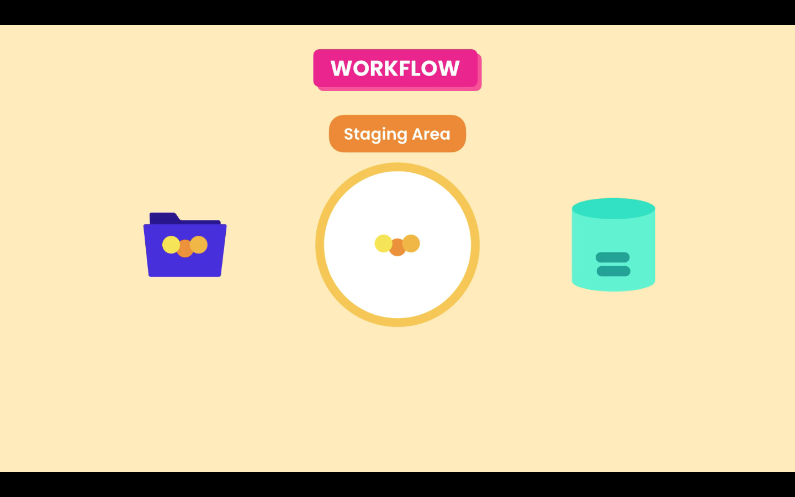

# 03- Git Workflow

## Workflow

In the daily work, we modify one or more files. When we believe that we reach a point that we want to record we commit those changes into the repository. Creating a commit it is like taking a snapshot of our project.

In Git there is a special area, an intermedial area, between the ***Working Directory*** and the ***Repository***. Its called the ***Staging*** or ***Index*** area. Files in these are are the one that will be in the next coommit.



First we add our changes to the **Staging Area**, and there we are able to review our changes, and them we make a commit. The commit will we save a snapshot to the repository. If some of the changes should not the saved in the next commit, we can remove that file from the **Staging Area**.

After we make the commit the **Staging Area** it is not emptied. What we have there now is the same snapshot the was record in the repository.

## Git commands

### git add

To add files to the staging area we use the `git add` command:

```zsh
git add file1 file2
```

We can add multiple files at the same time or use `git add .` to add all files, that have been changed, in the current directory recursively.

### git commit

To record the snapshot to the repository we use the `git commit` command, with the `-m` flag and a meaningful message, about the changes we have made.

```zsh
git commit -m "Initial commit"
```

Each commit contains a unique identifier, and also information of what was changed:

- ID
- Message
- Date / time
- Author
- Complete snapshot of the project

```zsh
commit f289d8ab48e5530b659931667edbc73e3eb10e29 (HEAD -> main, origin/main)
Author: Miguel Pimenta <my-email@code.com>
Date:   Sat Feb 27 23:15:48 2021 -0300

    First commit
```

Unlike other VCS Git stores, in each commit, the full snapshot of the project. Other VCS only store deltas or what was changed. Git those these in a very efficient manner, compressing the content and it does not store duplicates.
