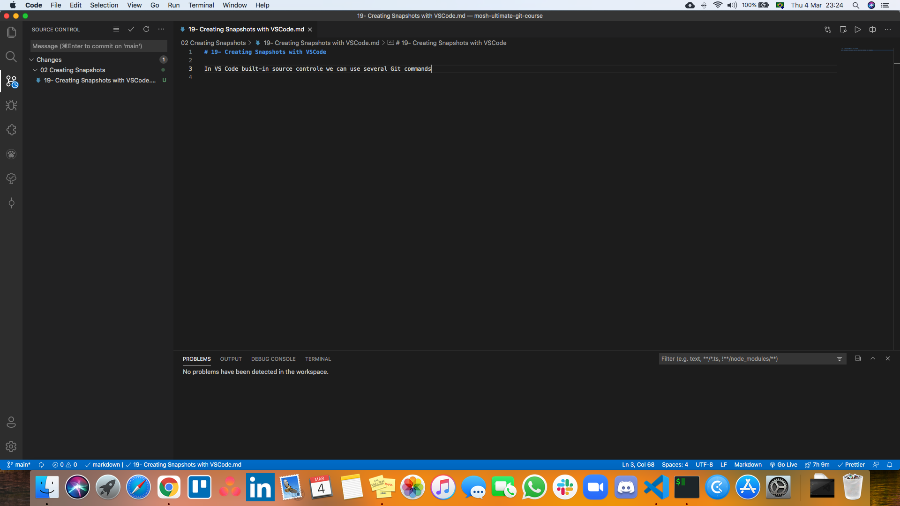

# 19- Creating Snapshots with VSCode

In VS Code built-in source controle we can use several Git commands.

The view in the left panel is similar to the `git status` output.

If we hover the mouse hover a file we will see a **`+`** sign. That will add files to the **Staging Area**. If that file is already in the **Staging Area** a **`-`** sig will be displayed, to remove the file from the **Staging Area**.
