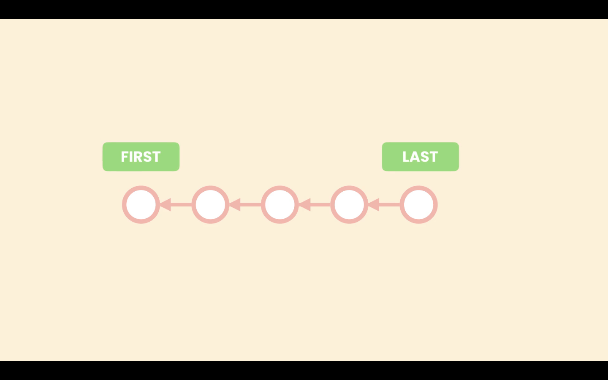
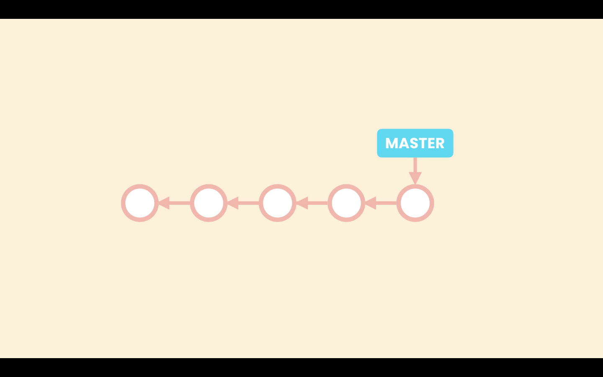
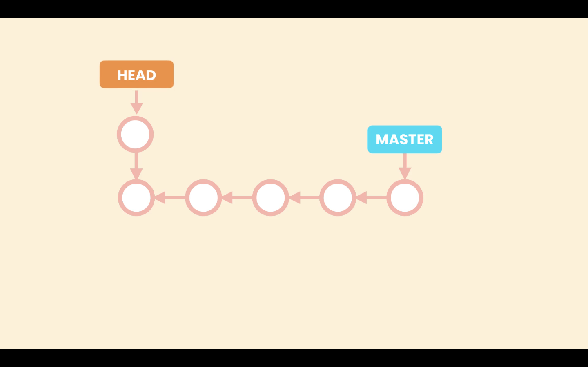
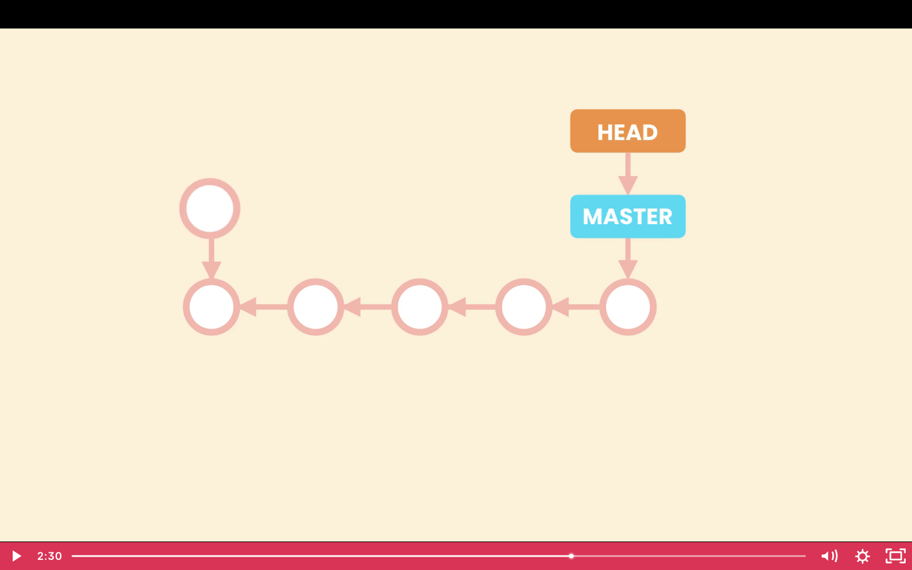

# 09- Checking Out a Commit

When we need to see the complete project in a given point in time we can check out a given commit, and it will restore our **Working Directory** to that point in time. Using the command `git checkout <commit>`. For example `git checkout 12156df`.

This will bring a warning:

```zsh
Note: switching to 'b9e25df'.

You are in 'detached HEAD' state. You can look around, make experimental
changes and commit them, and you can discard any commits you make in this
state without impacting any branches by switching back to a branch.

If you want to create a new branch to retain commits you create, you may
do so (now or later) by using -c with the switch command. Example:

  git switch -c <new-branch-name>

Or undo this operation with:

  git switch -

Turn off this advice by setting config variable advice.detachedHead to false

HEAD is now at b9e25df start new lesson
```

In Git each commit is pointing to the last commit That is ou Git maintains history.



Until now all the commits created are part of a branch, the `master` or `main`. The way Git represents branches is using a pointer, so `master` is pointing to the last commit created. As we create new commits master moves forward to point to the last commit.



Because we can have multiple branches Git needs to know in which branch we are working at the moment. To do that Git uses another special pointer called `HEAD`, so `HEAD` points to the current branch we are working on. In this case `master`. We have seen this in the `git log` command **`(HEAD -> main)`**.

```zsh
2ee3bb6 (HEAD -> main) add details to lesson
18869aa lesson complete
f2150f7 lesson complete
4acfee7 lesson complete
```

When we checkout a particular commit, the `HEAD` pointer will move to that commit, thats is what is called a `detached HEAD`. `HEAD` is not pointing to a branch but is pointing to a specific commit.


In this situation we should not create new commits. If we make changes and create a new commit, that commit will be added where the `HEAD` pointer is at the moment. But eventual we will attach the HEAD pointer to a branch, so the commit created it is not reachable by any other commit or pointer, ist like a dead commit. Git checks for commits like these periodically and removes them to save space.



Lost commit.

