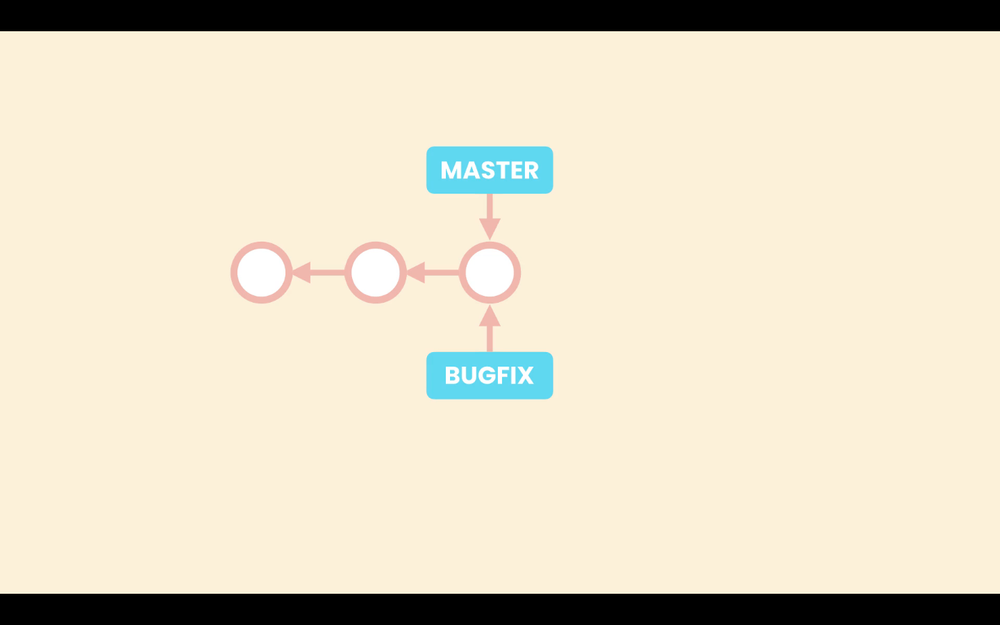
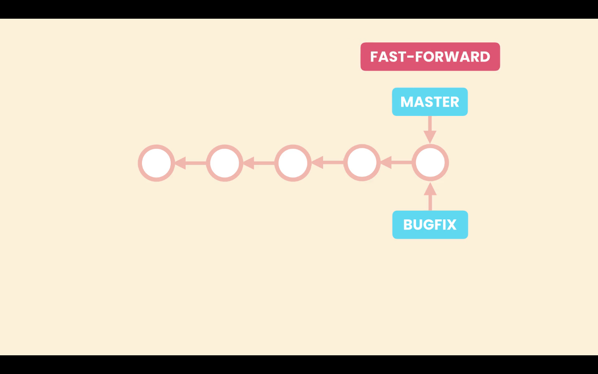
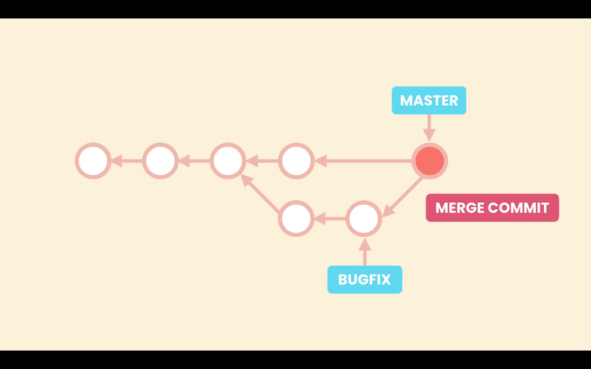

# 07- Merging

[Git merging docs](https://git-scm.com/book/pt-br/v2/Git-Branching-Basic-Branching-and-Merging)

Merging is about bringing changes from one brach to another.

In Git we have two types of merges:

1. Fast-forward merges
2. 3-way mergers

## Fast-forward merges

When we create new brach, let's call it ***bugfix***, from the ***main*** branch, both branches, ***main*** and ***bugfix***, will be pointing to the same commit.

Then when we switch to ***bugfix*** and start working on it and committing to it, the ***bugfix*** branch moves forward and **main** stays in the same place. This branches have not diverged and there is a direct linear path between them.

This way all Git has to do to merge the changes is to bring the master pointer forward. This is the fast-forward merge. Git run this type of merge when there is a direct linear path between the two branches.

## 3-way merge

A 3-way merge happens when we apply some changes to the ***main*** branch, and commit them, after we created the ***bugfix*** branch. So we have some changes in ***main*** that do not exist in the ***bugfix*** branch. In this situation the two branches are diverged.

In this situation, when we run a merge git create a new commit that merges this two branches. This is called a 3-way merge because this merge commit is base in three different commit, the common ancestor of both branches, which has the before code, and the tips of both branches, tha contain the after code.

