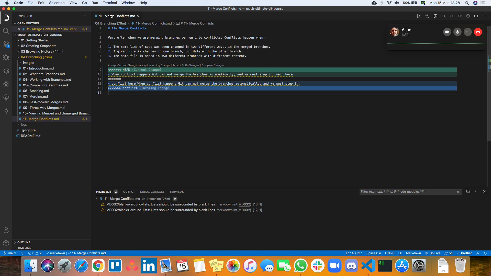

# 11- Merge Conflicts

Very often when we are merging branches we run into conflicts. Conflicts happen when:

1. The same line of code was been changed in two different ways, in the merged branches.
2. A given file is changes in one branch, but delete in the other branch.
3. The same file is added in two different branches with different content.

When conflict happens Git can not merge the branches automatically, and we must step in. After running `git merge <name-of-branch>` we will be warned and in `git status` we can see the following:

```zsh
❯ git status
On branch main

You have unmerged paths.
  (fix conflicts and run "git commit")
  (use "git merge --abort" to abort the merge)

Unmerged paths:
  (use "git add <file>..." to mark resolution)
    both modified:   04 Branching (76m)/11- Merge Conflicts.md

no changes added to commit (use "git add" and/or "git commit -a")
```

As we can see `Unmerged paths` is were the conflict is. If we open the file in VS Code, during the merge operation, we will see the conflict



Here we can use VS Code options, or edit the file manually to solve the conflict. When solving conflicts we should avoid at all cost adding new code.

After finishing resolving the conflict, we must add the file to the **Staging Area**, with `git add <file>`, and commit it. Because this is a merge commit, we do not need to pass a message, we can accept the default message, just run `git commit`.
