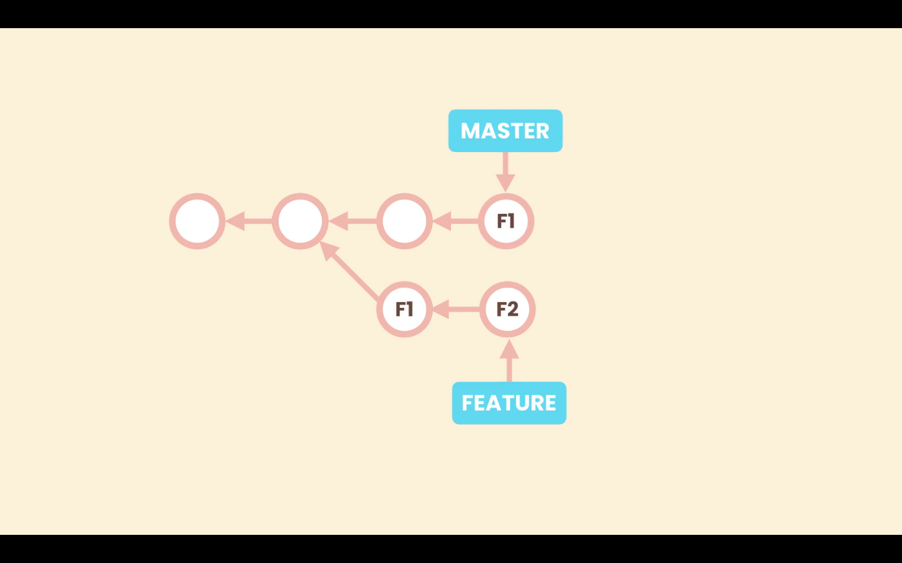

# 17- Cherry Picking

Imagine we are working in a branch that is diverged from **_`main`_**, and we need one of the commits from this branch in **_`main`_**. Just one commit, not a full merge.



To achieve this we use cherry picking.

First we must be in the **_`main`_**, and then there we run `git cherry-pick <commit-ID>`

```zsh
git cherry-pick 5670ecc
```

Then we must make a commit. We do not need to specify a message, wen we run `git commit`, the default editor will open with a default message based in the commit we are cherry picking, we can accept it or change it.
