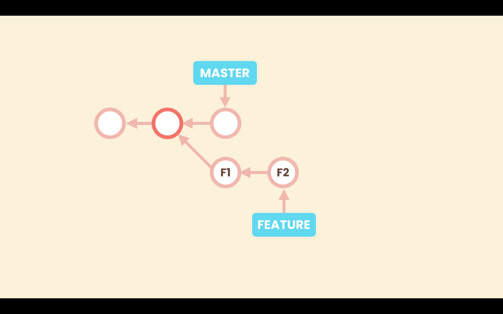
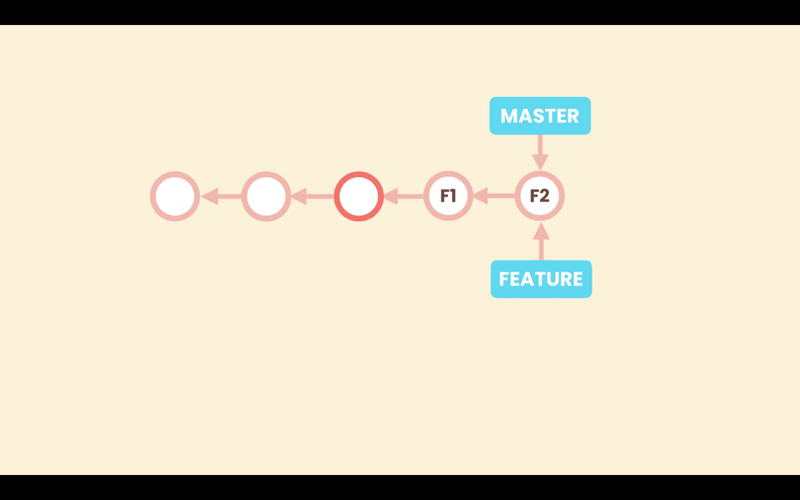

# 16- Rebasing

Suppose we have **_`main`_** and a new branch, let's call it **feature**, that have diverged. With the rebase technic we can change the base of the **feature** branch, making the base of the branch the latest commit on **_`main`_**. This will result in a linear history.



After rebasing the base commit of **feature** will be the latest commit on **_`main`_**.


Then when we merge **feature** into **_`main`_**, it is like a fast-forward merge, with linear history.



## How does Rebase merge work

We should be caution with rebasing because it rewrites history, and so we should only apply it, if we have not shared our history, with other people.

Git commits are immutable, so what actually happens with rebasing, is that Git creates new commits that look like the commits in our branch **feature**, and applies them in top of **_`main`_**.


Then Git move the pointer of **feature** to the latest commit of new commit that it has created. The original commit, in this case **F1** and **F2**, will be considered garbage for Git and it will eventually remove them.


## Rebase command

First in the new branch in this case **feature** we run `git rebase main`.

```zsh
❯ git rebase main
Successfully rebased and updated refs/heads/feature
```

Then we switch to **_`main`_** and run `git merge <name-of-branch>`.

```zsh
git merge feature
```

## Resolving conficts

### Rebase `--continue`

Resolving conflicts is similar as in other situations. When we run `git rebase main`, we will be warned of conflicts. After resolving this conflicts we run:

```zsh
git rebase --continue
```

This will make Git apply the next commit on top of **_`main`_**. It is possible that, the next commit also as a conflict, so we must resolve it once more.

### Rebase `--skip`

We can use the `--skip` option to skip the current commit and move to the next commit. For example if the conflict appear in a particular commit, but we do not care about that commit.

```zsh
git rebase --skip
```

### Rebase `--abort`

We can abort the rebase operation with the option `--abort`. For example if we have to many conflict and do not want to go throw a complete rebase. Aborting the rebase will take us back to the previous state before starting rebasing.

```zsh
git rebase --abort
```

## Merge tool backup file

Depending on the merge tool, after we abort the rebase operation, it can create backup files from the conflict. If we do not need this file we can just remove it.

To prevent the merge tool from automatically creating this files we can set:

```zsh
git config --global mergetool.keepBackup false
```
