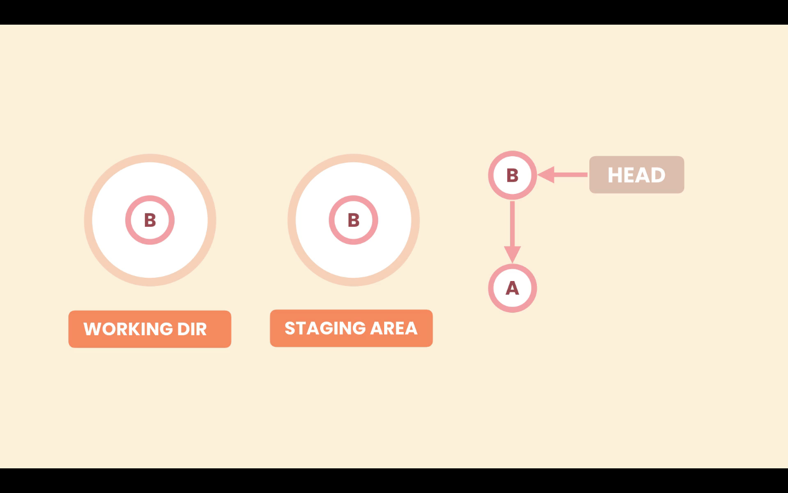
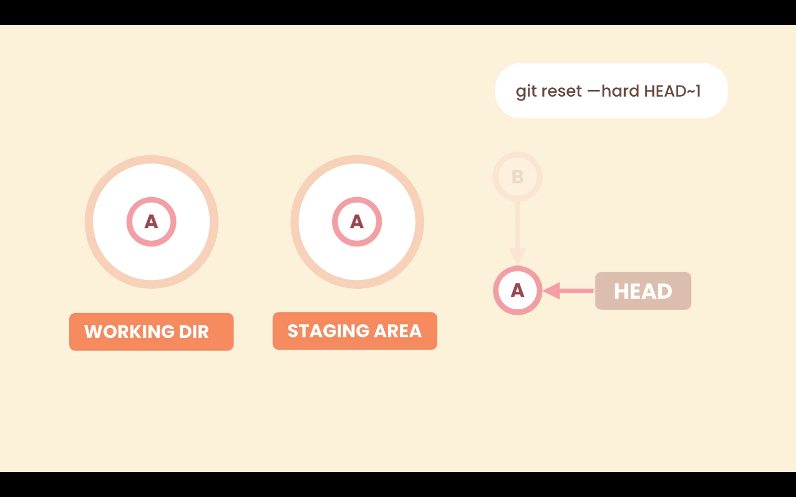

# 05- Undoing Commits

As we seen before if we have pushed a commit to a public **Remote Repository** we should not remove it.

```zsh
❯ git log --oneline --graph
* 088455d (HEAD -> master) .
* f666091 WIP
* 111bd75 Update terms of service and Google Map SDK version.
* 72856ea WIP
* 8441b05 Add a reference to Google Map SDK.
* 8527033 Change the color of restaurant icons.
* af26a96 Fix a typo.
* 6fb2ba7 Render restaurants the map.
* 70ef834 Initial commit
```

For example if we want to undo the last commit `088455d (HEAD -> master) .` we have two options:

1. Revert commit -> The has been pushed to a public **Remote Repository**
2. Reset commit -> The has not been pushed to a public **Remote Repository**

## Reset commit

Resetting a commit removes this commit from the history. We use the `reset` command and we have to give it the target commit. We can do that using the `HEAD~n` syntax, which means `n` commits back from the commit `HEAD` is pointing to usually the last commit.

```zsh
git reset --hard HEAD~1
```

### Options to the reset command

We have the following options:

- `--soft` -> Removes the commit only
- `--mixed` -> Unstages files
- `--hard` -> Discards local changes

For example, let's say we have two commits in our **Local Repository** `A` and `B`, and `B` is the last commit because `HEAD` is pointing to it. In the **Staging Area** and **Working Directory** we have the same code as in the last snapshot (**Local Repository**).



#### Option --soft

The `--soft` option only changes the **Local Repository**. Removes the commit only.

If we use `git reset --soft HEAD~1`, Git will point `HEAD` to the target location, in the **Local Repository**, but it is not going to touch the **Staging Area** and **Working Directory**.


This is the same state as before we committed `B`. We have some changes in the **Staging Area** and **Working Directory**, that have not yet been committed.

#### Option --mixed

The `--mixed` option will change the **Local Repository** and the **Staging Area**. We go one step back, it will unstage the changes.

With the `--mixed` option Git will move the `HEAD` pointer, from `A` to `B` as in the `--soft` option, and will put the last snapshot in the **Staging Area** as well, but it will not touch the **Working Directory**.


This is the same state as before we staged our changes. We have some changes in the **Working Directory**, that have not yet been staged.

#### Option --hard

The `--hard` option will change the **Local Repository**, **Staging Area**, and the **Working Directory**. Even one more step back, discards local changes.

With the `--hard` option Git will move the `HEAD` pointer, from `A` to `B` as in the `--soft` option, and it will put the last snapshot in the **Staging Area** and the **Working Directory**. So the new changes in the **Working Directory** are gone.


