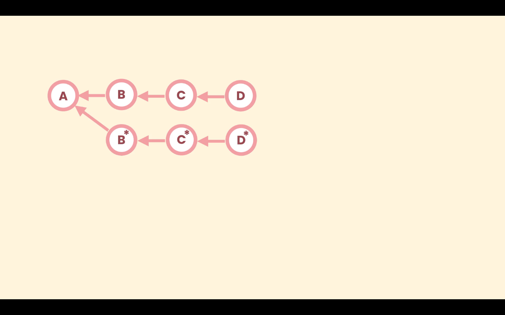

# 09- Amending an Earlier Commit

To amend an earlier commit we use interactive rebasing. With rebasing we can replay other commits on top of a commit. First we choose the commit we need to amend and pass it parent to the `rebase` command with the `-i` option, like `git rebase -i <commit>`.

We can modify one or more commits. Git will recreate each commit that goes through the rebase operation even if the are not edit.



In the above image suppose we only changed commit `B`, Git will recreate `C` and `D` to point not the new `B` commit.

Rebasing is a destructive operation because it rewrites history.

The `-i` option means we are going to interact with the rebase operation, stop it, make changes, continue it or abort it.

This command will open de default editor with a script, listing all the commits we need to rebase, and instructions to perform the `rebase` operation. Just like the following example:

```zsh
pick 8f1440a Add a reference to Google Map SDK.
pick 098a4bc Render restaurants the map.
pick 0bf60fe Fix a typo.
pick dd8f07e Change the color of restaurant icons.
pick ba55176 Update terms of service and Google Map SDK version.
pick f820221 WIP
pick 65dbb96 .

# Rebase 70ef834..65dbb96 onto 70ef834 (7 commands)
#
# Commands:
# p, pick <commit> = use commit
# r, reword <commit> = use commit, but edit the commit message
# e, edit <commit> = use commit, but stop for amending
# s, squash <commit> = use commit, but meld into previous commit
# f, fixup <commit> = like "squash", but discard this commit's log message
# x, exec <command> = run command (the rest of the line) using shell
# b, break = stop here (continue rebase later with 'git rebase --continue')
# d, drop <commit> = remove commit
# l, label <label> = label current HEAD with a name
# t, reset <label> = reset HEAD to a label
# m, merge [-C <commit> | -c <commit>] <label> [# <oneline>]
# .       create a merge commit using the original merge commit's
# .       message (or the oneline, if no original merge commit was
# .       specified). Use -c <commit> to reword the commit message.
#
# These lines can be re-ordered; they are executed from top to bottom.
#
# If you remove a line here THAT COMMIT WILL BE LOST.
#
# However, if you remove everything, the rebase will be aborted.
#
```

After configuring the script the rebase operations starts.

```zsh
❯ git rebase -i 8527033
Stopped at 8441b05...  Add a reference to Google Map SDK.
You can amend the commit now, with

  git commit --amend '-S'

Once you are satisfied with your changes, run

  git rebase --continue
```

Here we can make the necessary changes, and then amend the commit. when we are done we run `git rebase --continue`, to continue the operation.

To abort the rebase operation in any point use the `--abort` option. `git rebase --abort`.

In a rebase operation, a change introduced in a earlier commit will be carried on thought the history.
